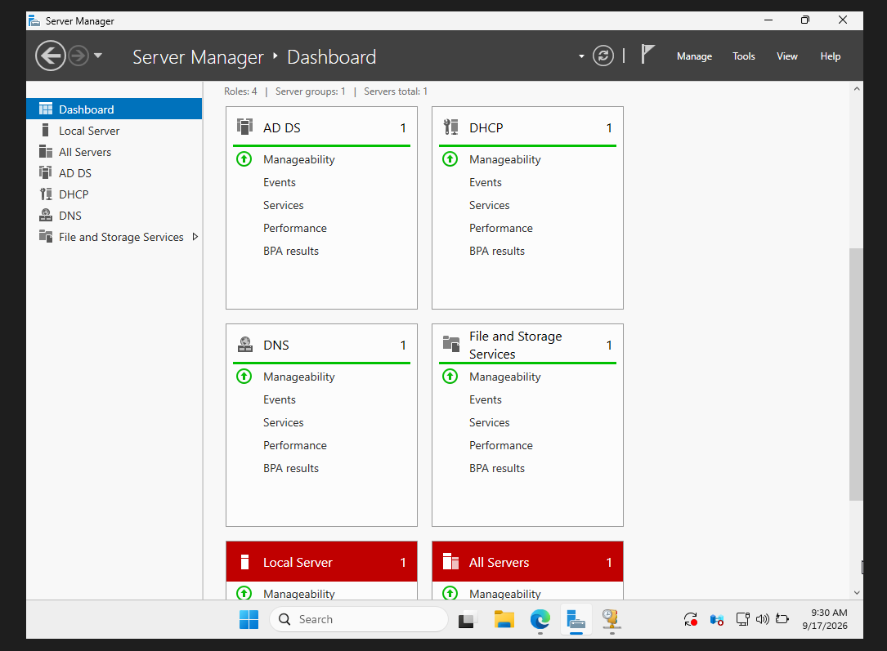

# 🖥️ Windows Server Enterprise Infrastructure

## 📌 Présentation du projet

Dans le cadre de ce projet, j’ai mis en place une infrastructure réseau d’entreprise virtualisée avec VirtualBox.

L’objectif était de créer un environnement permettant de centraliser la gestion des utilisateurs, des ordinateurs, des adresses IP et des règles de sécurité.

L’infrastructure repose principalement sur **Windows Server**, avec l’intégration de **Active Directory Domain Services (AD DS), DNS, DHCP, GPO et File Server**, ainsi que **pfSense** pour la gestion du réseau.

## 🛠️ Technologies utilisées

- Windows Server
- Active Directory Domain Services (AD DS)
- DNS
- DHCP
- Group Policy (GPO)
- File Server
- pfSense
- Windows Client
- VirtualBox

## ⚙️ Réalisations

Au cours de ce projet, j’ai réalisé :

- Installation et configuration de Windows Server
- Mise en place d’Active Directory
- Création et organisation des OU
- Création des utilisateurs et groupes de sécurité
- Configuration du service DNS
- Configuration d’une plage DHCP
- Intégration d’un poste Windows au domaine
- Création et application de stratégies GPO
- Configuration des interfaces WAN et LAN de pfSense
- Tests de connectivité et validation de l’infrastructure

---
# 📸 Captures du projet

# 📸 Captures du projet

## 🖥️ Services Windows Server

Installation et configuration des principaux services Windows Server : Active Directory Domain Services (AD DS), DNS, DHCP et services de fichiers.

---

## 🌐 Configuration de la plage DHCP

Configuration d'une plage d'adresses DHCP permettant l'attribution automatique des paramètres réseau aux postes clients.

---

## 🔥 Configuration WAN et LAN de pfSense

Configuration des interfaces réseau WAN et LAN de pfSense afin d'assurer la communication entre le réseau interne et le réseau externe.

---

## 🔐 Interface Web pfSense

Accès à l'interface Web d'administration de pfSense pour gérer et superviser le pare-feu et les interfaces réseau.

---

## 🌐 Configuration réseau du serveur

Vérification de la configuration IP du serveur Windows et de sa passerelle réseau.

---

## 👥 Organisation Active Directory

Création des unités d'organisation (OU) RH et Direction et organisation des utilisateurs dans Active Directory.

---

## 👤 OU Direction

Création de l'OU Direction et ajout de l'utilisateur Ahmed Directeur dans Active Directory.

---

## 👥 Groupe de sécurité GRP-RH

Création et configuration du groupe de sécurité GRP-RH avec ajout des utilisateurs du service RH.

---

## 🔒 Configuration de la GPO Direction

Configuration d'une stratégie de groupe (GPO) pour appliquer des restrictions aux utilisateurs de l'OU Direction.

---

## ✅ Validation de la GPO

Vérification de l'application de la stratégie GPO-DIRECTION sur le poste utilisateur.

---

## 💻 Configuration IP du poste client

Vérification de l'adresse IP obtenue par le poste client depuis le serveur DHCP.

---

## 🌐 Vérification du domaine

Vérification de la connexion du poste client au réseau et au domaine Active Directory.

---

## 🔑 Connexion Active Directory

Connexion réussie d'un utilisateur Active Directory sur un poste Windows membre du domaine.

## 13 — Connexion de l'utilisateur Active Directory

